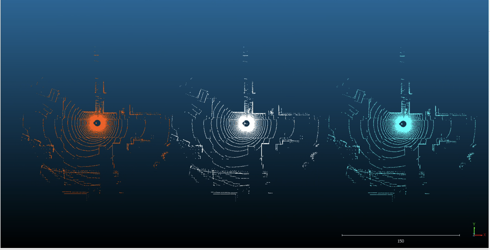
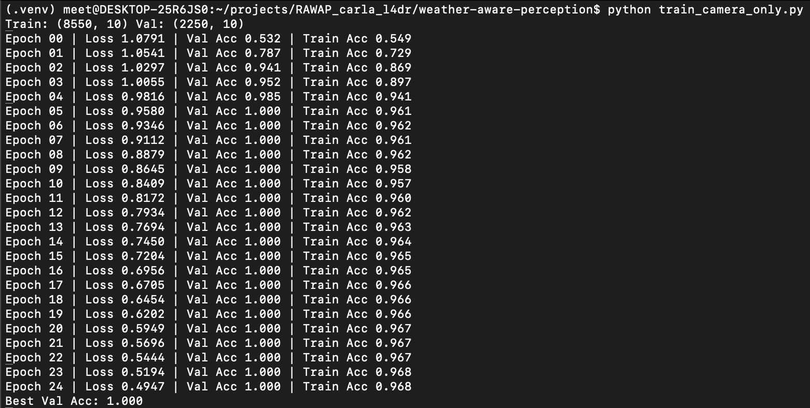
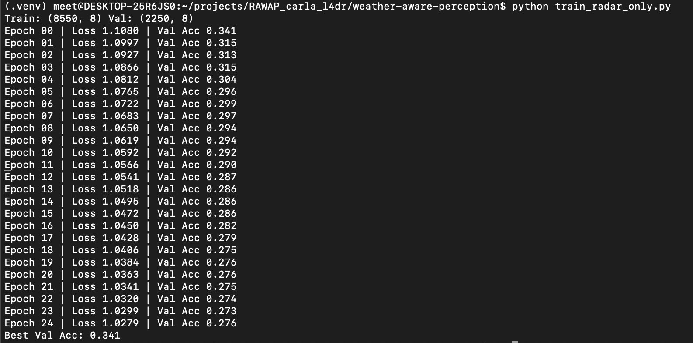
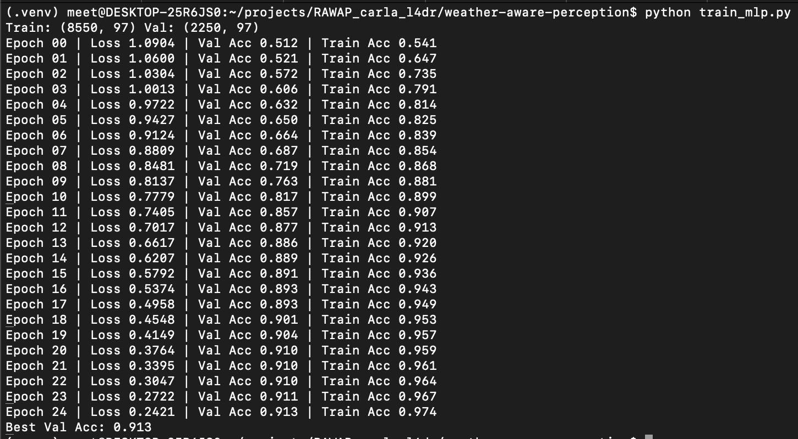
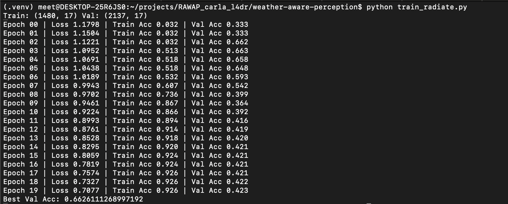

# Weather-Aware Multi-Sensor Perception

This repository contains the code used for the project **Weather-Aware Multi-Sensor Perception in Simulation: A Comparative Study of CARLA and Real-World Radar Data**.

The project investigates whether adverse weather conditions can be inferred from sensor data, and whether CARLA simulation produces physically meaningful weather-dependent changes in camera, LiDAR, and radar streams.

## Summary

The project compares:

- CARLA camera, LiDAR, and radar data collected under clear, fog, and rain conditions
- Real-world radar data from the RADIATE dataset
- Sensor-specific and fusion-based statistical feature representations
- Classification performance across simulated and real-world sensing modalities

The main observation is that CARLA camera data strongly reflects rendered weather conditions, while CARLA LiDAR and radar data show limited weather-dependent variation under the tested setup. Real-world RADIATE radar data shows stronger separability, suggesting that radar weather signal exists in real data but is not captured well by the default CARLA radar model.

## Repository Structure

```text
configs/
  project_config.json
  sim_config.json

scripts/
  collect_two_cars.py
  collect_two_cars_2.py
  run_collect.sh
  run_collect_2.sh
  run_multi_weather.py
  run_multi_weather_2.py
  samplers.py

train_camera_only.py
train_radar_only.py
train_mlp.py
train_fusion_mlp.py
train_radiate.py

models/
  carla/
  fusion_lrc/
  radiate/

results/
  carla/
  radiate/

report.pdf
```

## Data Collection Scripts

### `scripts/collect_two_cars.py`

CARLA data collection script used for the LiDAR + radar + camera setup.

It records:

- LiDAR point clouds
- Four radar streams
- Front camera images
- Pose, calibration, and label metadata
- Preview `.ply` files for qualitative point-cloud inspection

### `scripts/collect_two_cars_2.py`

CARLA data collection script used for the extended camera + radar experiments.

It records:

- Front camera images
- Four radar streams
- Pose, calibration, and label metadata

This script corresponds to the CARLA dataset used for camera-only, radar-only, and camera-radar fusion experiments.

### `scripts/run_collect.sh`

Wrapper script for running the CARLA collection pipeline using `collect_two_cars.py`.

### `scripts/run_collect_2.sh`

Wrapper script for running the extended CARLA collection pipeline using `collect_two_cars_2.py`.

### `scripts/run_multi_weather.py`

Runs CARLA data collection across multiple weather regimes using the LiDAR + radar + camera setup.

### `scripts/run_multi_weather_2.py`

Runs CARLA data collection across multiple weather regimes using the extended camera + radar setup.

### `scripts/samplers.py`

Contains helper logic for sampling weather configurations across clear, fog, and rain regimes.

## Training Scripts

### `train_camera_only.py`

Trains a weather classifier using only CARLA camera-derived statistical features.

Input data:

```text
raw/weather_dataset_extended_2/run_x/{clear,fog,rain}/ego/camera_front/*.png
```

Feature groups include grayscale intensity statistics, contrast-related statistics, dark/bright pixel ratios, and Laplacian variance.

### `train_radar_only.py`

Trains a weather classifier using only CARLA radar-derived statistical features.

Input data:

```text
raw/weather_dataset_extended_2/run_x/{clear,fog,rain}/ego/radar_front/*.npy
raw/weather_dataset_extended_2/run_x/{clear,fog,rain}/ego/radar_back/*.npy
```

### `train_mlp.py`

Trains a camera + radar model on CARLA data.

Input data:

```text
raw/weather_dataset_extended_2/run_x/{clear,fog,rain}/ego/
```


### `train_fusion_mlp.py`

Trains a full LiDAR + radar + camera model on CARLA data.

Input data:

```text
raw/weather_dataset_fusion_extended_2/run_x/{clear,fog,rain}/ego/
```

Expected input formats:

```text
camera_front/*.png
lidar/*.bin
radar_front/*.npy
radar_back/*.npy
```

### `train_radiate.py`

Trains a radar-only classifier using real-world RADIATE radar polar images.

Input data:

```text
raw/radiate/{train,val}/{clear,rain,fog}/Navtech_Polar/*.png
```

Feature groups include radar image intensity statistics, low/high intensity ratios, total energy, range-bin statistics, and angular variation statistics.

## Dataset Access

Datasets are not included in this repository due to size.

### CARLA Dataset

CARLA data can be regenerated using the scripts in `scripts/`.

The CARLA simulator must be running before launching the collection scripts.

Example:

```bash
bash scripts/run_collect_2.sh
python scripts/run_multi_weather_2.py
```

The expected CARLA dataset structure is:

```text
raw/weather_dataset_extended_2/
  run_000/
    clear/
      ego/
        camera_front/
        radar_front/
        radar_back/
    fog/
    rain/
```

For LiDAR fusion experiments:

```text
raw/weather_dataset_fusion_extended_2/
  run_000/
    clear/
      ego/
        camera_front/
        lidar/
        radar_front/
        radar_back/
    fog/
    rain/
```

### RADIATE Dataset

The RADIATE dataset can be obtained from:

https://pro.hw.ac.uk/radiate/

For this project, the radar polar images are organized as:

```text
raw/radiate/
  train/
    clear/Navtech_Polar/*.png
    rain/Navtech_Polar/*.png
    fog/Navtech_Polar/*.png
  val/
    clear/Navtech_Polar/*.png
    rain/Navtech_Polar/*.png
    fog/Navtech_Polar/*.png
```

## Some Visual Results

### LiDAR (CARLA)


### Camera-only Performance


### Radar-only Performance


### Fusion Performance


### RADIATE Performance



## Running the Training Scripts

Install dependencies:

```bash
pip install -r requirements.txt
```

Run experiments:

```bash
python train_camera_only.py
python train_radar_only.py
python train_mlp.py
python train_fusion_mlp.py
python train_radiate.py
```

## Notes

- Raw datasets are excluded from the repository.
- The final report is included as `report.pdf`.
- The `results/` directory may contain screenshots of some outcomes.
